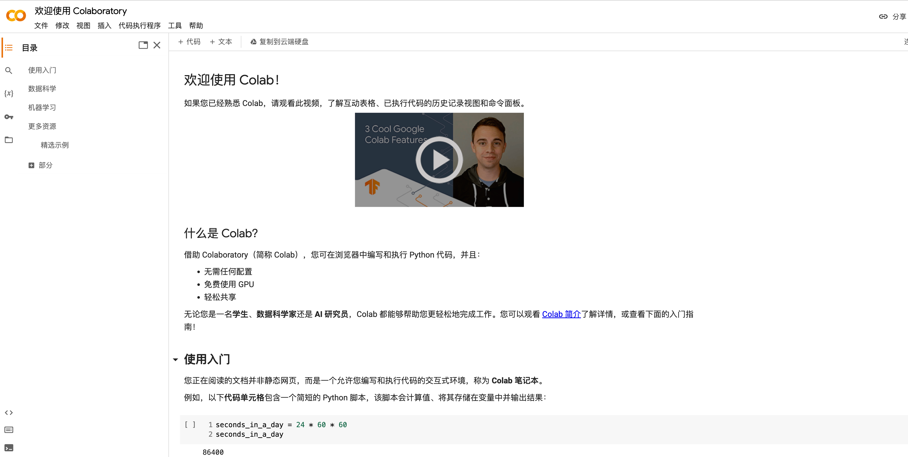
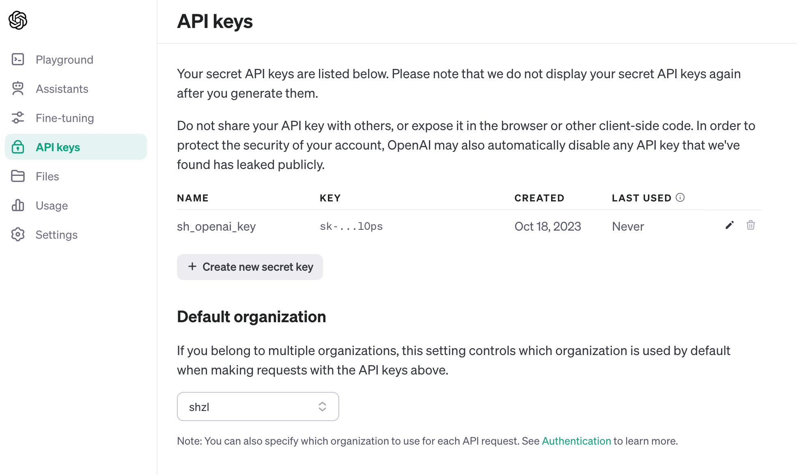
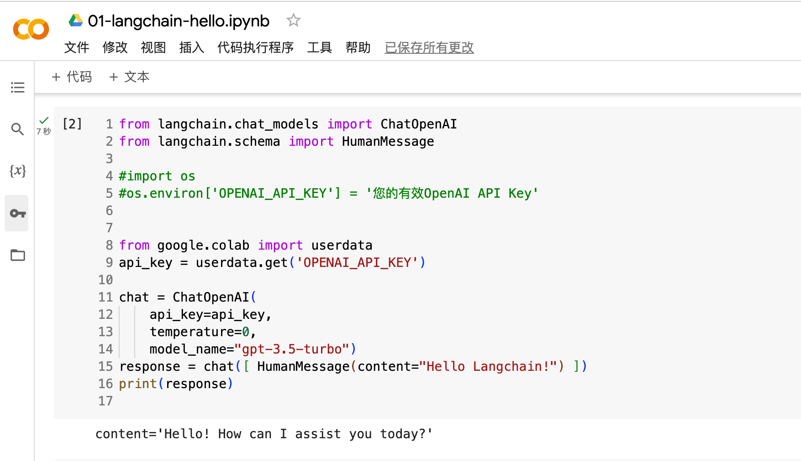

# Langchain 环境准备


学习 `Langchain` 需要准备相关的环境；

- 使用 `Python` 版本的[Langchain](https://github.com/langchain-ai/langchainjs)  或者 使用[javascript](https://github.com/langchain-ai/langchainjs) 版本
- `LLM` 我们这里使用 [OpenAI](https://platform.openai.com/docs/overview)的模型
- `Langchain` 由于目前还处于快速发展阶段，版本迭代非常的频繁，为避免示例代码失效，本教程统一使用版本 **0.0.334** 

根据 `Langchain` 的[代码约定](https://github.com/langchain-ai/langchain/blob/v0.0.334/pyproject.toml#L12C24-L12C24)，`Python` 版本 ">=3.8.1,<4.0"。

所有代码和教程开源在 github: [github.com/bluemsn/learn-langchain-with-me](https://github.com/bluemsn/learn-langchain-with-me)

-----

## Langchain 简介

`Langchain` 是一个开源框架，专门用于构建和操作基于大型语言模型（LLM）的应用。大型语言模型（LLM）正在成为一种具有变革性的技术，使开发人员能够构建以前无法实现的应用程序， 然而自 `openai` 出现以后， 各种大模型更是层出不穷， 但每种LLM 下 api 也存在较大的差异， 如何进一步抽象，降低开发者使用门槛， 只用聚焦在上层的应用上？ 便有了 `Langchain`;  让开发者可以更容易地整合和使用像GPT这样的模型来创建复杂的自然语言处理应用， 同时`Langchain` 也可以让你随时切换模型，也无需重新调整你的代码， 并且`Langchain`可以支持多种模型同时存在;

`Langchain` 旨在帮助开发这些类型应用程序，比如：
- 基于文档数据的问答
- 聊天机器人
- 代理

## OpenAI 简介

`OpenAI` 是LLM生态的模型层最大的玩家之一。 自 `2022.11` 一经推出便火爆全球, 大家目前熟知的 *GPT-3.5*，*GPT-4* 及 `2023.11` 新推出 `GPT-4-Turbo` 等 模型都是OpenAI的产品。它的API允许开发人员通过简单的API调用来访问这些模型， 构建大模型的能力， 包括 `ChatGPT`; 

## Langchain 与 OpenAI

`Langchain` 作为一个开源框架，提供与 OpenAI 等语言模型的接口，简化了在应用程序中集成和利用语言模型能力的过程;


## 开发前的准备

在开始第一个 Langchain 应用程序之前，我们需要做一些必要的准备。

### Google Colab

由于本地环境的搭建受各种因素带来不确的复杂性,  本教程中，将使用 `Google Colab` 在云端运行 `Python` 代码。 Google Colab（全称Google Colaboratory）是一个由 Google 提供的云端开发环境，用于数据分析、机器学习和深度学习任务。它基于 `Jupyter Notebook`，提供了一个免费的、云端的Python编程环境，用户可以直接在浏览器中编写和执行`Python`代码,  当然你也可以在本地搭建 [`Jupyter`](https://jupyter.org/)。

`Google Colab` 网址：[https://colab.research.google.com/](https://colab.research.google.com/)



无法使用 `Google Colab` 的同学，可以使用 [Visual Studio Code](https://code.visualstudio.com/) 配合Jupyter插件在本地运行代码。

### OpenAI API Key

在Langchain应用如何使用 `OpenAI` 的模型，我们需要一个API Key。点击[https://platform.openai.com/api-keys](https://platform.openai.com/api-keys)创建你的API Key, 并保存下来




## 开始 Langchain-HelloWorld


### 安装指令

这里我们安装 `langchain` `openai` 两个库其中给 langchain 指定了特定的版本

```shell
pip install langchain==0.0.334 openai
```


### 代码 
由于 在 `Jupyter` 中执行 shell 需要在当前加  `!`
即：

```shell
!pip install langchain==0.0.334 openai
```

```python
from langchain.chat_models import ChatOpenAI
from langchain.schema import HumanMessage

import os
os.environ['OPENAI_API_KEY'] = '您的有效OpenAI API Key'

chat = ChatOpenAI(temperature=0, model_name="gpt-3.5-turbo")
response = chat([ HumanMessage(content="Hello Langchain!") ])
print(response)

```

你应该能看到类似这样的输出：

```shell
content='Hello! How can I assist you today？'
```

或者 为了防止 api-key 泄露， `google-colab` 也提供了系统环境变更的设置，设置完成后， 你通过代码就可以直接调用，方便你分享你的代码，而不担心 `api-key` 的泄露；


```python
from google.colab import userdata
api_key = userdata.get('OPENAI_API_KEY')
```

最终的代码如下

```python
from langchain.chat_models import ChatOpenAI
from langchain.schema import HumanMessage

#import os
#os.environ['OPENAI_API_KEY'] = '您的有效OpenAI API Key'


from google.colab import userdata
api_key = userdata.get('OPENAI_API_KEY')

chat = ChatOpenAI(
    api_key=api_key,
    temperature=0,
    model_name="gpt-3.5-turbo")
response = chat([ HumanMessage(content="Hello Langchain!") ])
print(response)

```

## 运行代码

在 Google Colab 的页面，在每一个代码块，按 Ctrl/Cmd + Enter 即可运行代码，非常方便。
运行后即可同样看到以下输出；

```shell
content='Hello! How can I assist you today?' additional_kwargs={} example=False
```




最后我们再看一下代码

### 1、代码中导入了 `ChatOpenAI` 类，该类封装了OpenAI的聊天模型。

* `ChatOpenAI` 类的初始化参数 

  * `api_key` 设置 系统中的 api_key,否则你无法调用成功
  * `temperature` 用于控制模型的生成文本的多样性。`temperature` 越大，生成的文本越多样，但也越不可控。`temperature` 越小，生成的文本越单一，但也越可控。`temperature` 的取值范围为 0 到 1，默认值为 0.5。初始化参数 
  * `model_name` 用于指定使用的模型，这里我们选择使用 `gpt-3.5-turbo`; 你也可以使用其它模型；

```python
chat = ChatOpenAI(temperature=0, model_name="gpt-3.5-turbo")
```

### 2、 以下代码完成与OpenAI GPT模型的第一次对话，并打印出响应。

  ```python
  response = chat([ HumanMessage(content="Hello Langchain!") ])
  print(response)
  ```
 
## 总结
本节课程中，我们简要介绍了 `Langchain`，`OpenAI` 以及它们的关系，并完成了第一个 `Langchain` 应用 —— `Hello Langchain`。

### 相关文档资料链接：
[本课相关的代码](./Hello_Langchain.ipynb)
1. [Python Langchain官方文档](https://python.langchain.com/docs/get_started/introduction.html) 